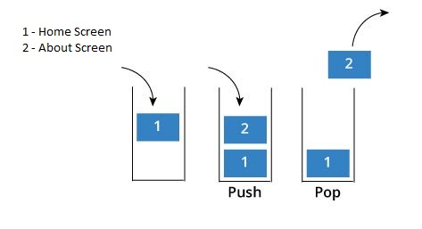

### Navigation in react native

By the end of this module developers would be able to understand the basic, vital concepts and sturcture of React such as :
 - Navigate between screens
 - Understand and use tab navigation
 
Navigation in react applications have been a simple yet hot concept in building react native apps. 
We will be using [React-Navigation](https://reactnavigation.org/) to navigate between screens in our application

### Navigate between screens
In react navigation we can move basically from one screen to another by implementing the idea of stack data structure.




As of version 5 of react navigation(latest stable), the **stack navigator** is a function that returns an object with 2 properties ```Screen``` and ```Navigator``` which is 


### Tab Navigation
Just as in the stack navigator, the tab navigator also returns same object as the stack


