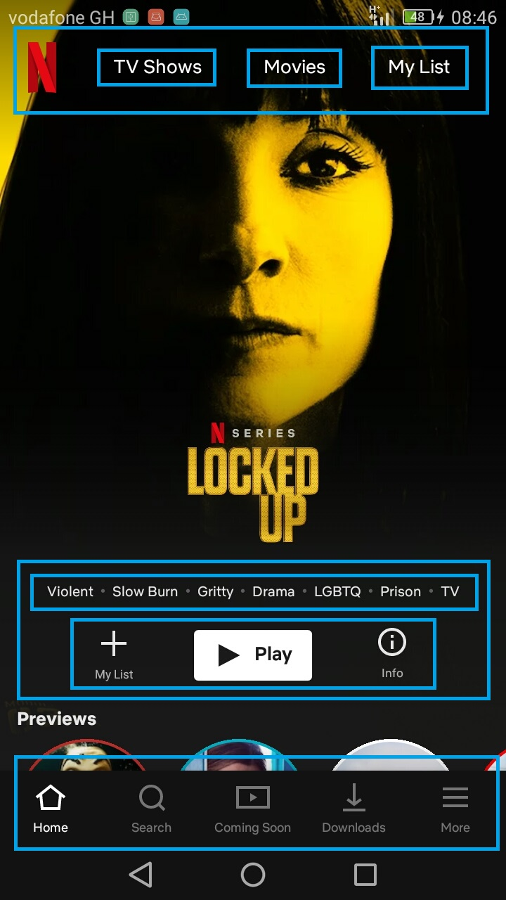

### Intro to React

By the end of this module developers would be able to understand the basic, vital concepts and sturcture of React such as :
 - Components
 - State
 - Props
 - Hooks
 - How to structure your app


#### Components.
 They are pieces which make up our UI. They are driven by some data. They are usually written in classes until recently that the classes seem a little bit verbose and they are going with functional ones.

 

 There is basically one component known as the root component. In our case, this is ```App.js```

 

#### State
 Data that drives the application. They are set in the classes constructor and used in functional components with the ```useState``` hook in react >=16.8.
 We can control the rendering of our components or the UI with state.And this is used in tons of applications.

#### Props
 Data that drives our application. Then what is the difference between the **props** and **state**.
 Simple. Props are read only to the component but state are mutable data.
 Props can be accessible simple neaby and other components but state values are not shared between components.


#### Hooks
  Since functional components make it a little easy for us to understand, react >=16.8 blessed us with hooks which allow us to handle almost all the **lifecycle methods** and manage state
  ```useState```


#### How to structure your app
 There is no laid down rule for sturcturing your application but code is written for humans to read and machines to execute so there is a need to have a nice structure of your entire application.

```
├── ...
├── src                    
│   ├── components/   
│   ├── navigation/   
│   ├── screens/ 
│   └── ...
├── assets                    
│   ├── images
|   ├── fonts    
├── App.js
└── ...
```

### Useful Links 
 - [React Props](https://reactjs.org/docs/components-and-props.html)
 - [React State](https://reactjs.org/docs/state-and-lifecycle.html)
 - [React Hooks](https://reactjs.org/docs/hooks-intro.html)
 - [React-Native](react-native.dev)